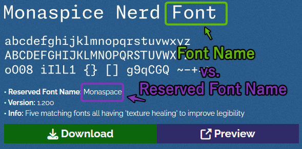

# nerd-fonts-woff2

[](https://github.com/Nick2bad4u/nerd-fonts-woff2/blob/main/LICENSE) [](https://www.npmjs.com/package/nerd-fonts-woff2) [](https://github.com/Nick2bad4u/nerd-fonts-woff2/releases) [](https://github.com/Nick2bad4u/nerd-fonts-woff2/stargazers) [](https://github.com/Nick2bad4u/nerd-fonts-woff2/forks) [](https://github.com/Nick2bad4u/nerd-fonts-woff2/issues) [](https://codecov.io/gh/Nick2bad4u/nerd-fonts-woff2)

Ready-to-use **Nerd Fonts in WOFF2 format** — use them in any website or app via CDN link, or install them through npm.

No build step needed. No tools to install. Just copy a URL.

> Fonts are generated from [Nerd Fonts v3.4.0](https://github.com/ryanoasis/nerd-fonts/releases/tag/v3.4.0)
> and committed directly to this repository so they can be served from a stable CDN URL.

---

## Quick start — add a font to your website

Pick any font from the [available families](#available-font-families) below and add a `@font-face` rule to your CSS.

### jsDelivr CDN (recommended — global CDN, fast, always available)

```css
@font-face {
  font-family: "JetBrains Mono Nerd";
  src: url("https://cdn.jsdelivr.net/gh/Nick2bad4u/nerd-fonts-woff2@v1.0.0/fonts/woff2/JetBrainsMono/JetBrainsMonoNerdFont-Regular.woff2")
    format("woff2");
  font-display: swap;
}
```

Then use it in your CSS:

```css
body {
  font-family: "JetBrains Mono Nerd", monospace;
}
```

### Raw GitHub URL

```css
@font-face {
  font-family: "JetBrains Mono Nerd";
  src: url("https://raw.githubusercontent.com/Nick2bad4u/nerd-fonts-woff2/v1.0.0/fonts/woff2/JetBrainsMono/JetBrainsMonoNerdFont-Regular.woff2")
    format("woff2");
  font-display: swap;
}
```

> **Tip:** Always pin a version tag (`v1.0.0`) rather than using `main` so your fonts never change unexpectedly.

---

## URL pattern

All font files follow this pattern:

```text
https://cdn.jsdelivr.net/gh/Nick2bad4u/nerd-fonts-woff2@<version>/fonts/woff2/<Family>/<FileName>.woff2
```

| Part         | Example                         |
| ------------ | ------------------------------- |
| `<version>`  | `v1.0.0`                        |
| `<Family>`   | `JetBrainsMono`                 |
| `<FileName>` | `JetBrainsMonoNerdFont-Regular` |

Find available files by browsing the [`fonts/woff2/`](./fonts/woff2) folder in this repository, or see the full [asset index](./fonts/woff2/index.json).

You can also browse a searchable index page on GitHub Pages: [`/index.html`](./index.html)

---

## Install via npm

The npm package ships the **CLI conversion tool only** — font files are not bundled.
To use fonts in a website or app, use the CDN URLs above (no install needed).

```bash
npm install nerd-fonts-woff2
# or globally
npm install -g nerd-fonts-woff2
```

Package size: **\~86 KB unpacked** (just the CLI binary + compiled JS).

> The fonts themselves are served from CDN (jsDelivr, unpkg, Raw GitHub, etc.).
> Bundling 7 GB of binary font files into npm would be impractical — use a CDN URL instead.

---

## CLI usage

The CLI converts local TTF/OTF font files into WOFF2 format.

### Usage

```bash
npx nerd-fonts-woff2 --source-dir <path> [options]
# or if installed globally:
nerd-fonts-woff2 --source-dir <path> [options]
```

### Core options

| Flag                            | Description                                                  |
| ------------------------------- | ------------------------------------------------------------ |
| `--source-dir <path[,path...]>` | Source directory containing `.ttf`/`.otf` files (repeatable) |
| `--manifest <file>`             | JSON config file (optional alternative to CLI flags)         |
| `--out-dir <path>`              | Output directory for generated `.woff2` files                |
| `--temp-dir <path>`             | Temporary working directory                                  |
| `--include-ext <ttf,otf>`       | Input extensions to process (default: `ttf,otf`)             |
| `--max-files <n>`               | Limit number of files to process                             |

### Conversion options

| Flag                      | Description                                            |
| ------------------------- | ------------------------------------------------------ |
| `--convert`               | Run conversion pipeline (default mode is plan/dry-run) |
| `--dry-run`               | Plan only — do not call the external converter         |
| `--confirm`, `--yes`      | Required safety gate for non-dry-run conversion        |
| `--converter <cmd>`       | Converter executable (default: `woff2_compress`)       |
| `--converter-arg <value>` | Extra converter arguments (repeatable)                 |
| `--fail-fast`             | Stop on first conversion failure                       |
| `--concurrency <n>`       | Number of concurrent conversions (default: `1`)        |
| `--timeout <ms>`          | Per-file converter timeout in ms (default: `60000`)    |

### Output options

| Flag                  | Description                                              |
| --------------------- | -------------------------------------------------------- |
| `--index-file <path>` | Write asset index JSON (default: `<out-dir>/index.json`) |
| `--verbose`           | Print planned files and failures                         |
| `--debug`             | Enable debug output (implies `--verbose`)                |
| `--json`              | Emit machine-readable summary to stdout                  |
| `--help`              | Show help                                                |

### Examples

```bash
# Dry run — plan only, no files written (safe default)
npx nerd-fonts-woff2 --source-dir ./fonts/original --dry-run

# Convert with explicit safety confirmation
npx nerd-fonts-woff2 --source-dir ./fonts/original --convert --confirm

# Faster — 4 concurrent workers, 2 min timeout per file
npx nerd-fonts-woff2 --source-dir ./fonts/original --convert --confirm --concurrency 4 --timeout 120000

# Machine-readable JSON output + explicit index file path
npx nerd-fonts-woff2 --source-dir ./fonts/original --convert --confirm --json --index-file ./fonts/woff2/index.json

# Use a manifest config file instead of flags
npx nerd-fonts-woff2 --manifest ./nerd-fonts-woff2.config.json --convert --confirm --json

# Convert multiple source directories
npx nerd-fonts-woff2 --source-dir ./fonts/originals,./fonts/extras --convert --confirm
```

---

## Available font families

All families from [Nerd Fonts v3.4.0](https://github.com/ryanoasis/nerd-fonts/releases/tag/v3.4.0) are included.

Browse the full list in the [`fonts/woff2/`](./fonts/woff2) directory, or search the [interactive browser](https://nick2bad4u.github.io/nerd-fonts-woff2/).

Popular families by `reserved font name` (see [Reserved Font Name mechanism](https://openfontlicense.org/webfonts-and-reserved-font-names/)).

For example, the `Monaspice Nerd Font` family is available as `Monaspace` in the URL path and file names:



| Family                                                                                                              | Preview Font                                                                            | Folder                                                         |
| ------------------------------------------------------------------------------------------------------------------- | --------------------------------------------------------------------------------------- | -------------------------------------------------------------- |
| [3270](https://github.com/ryanoasis/nerd-fonts/releases/download/v3.4.0/3270.zip)                                   | [Preview Font](https://www.programmingfonts.org/#font3270)                              | [`3270`](./fonts/woff2/3270)                                   |
| [Agave](https://github.com/ryanoasis/nerd-fonts/releases/download/v3.4.0/Agave.zip)                                 | [Preview Font](https://www.programmingfonts.org/#agave)                                 | [`Agave`](./fonts/woff2/Agave)                                 |
| [AnonymousPro](https://github.com/ryanoasis/nerd-fonts/releases/download/v3.4.0/AnonymousPro.zip)                   | [Preview Font](https://www.programmingfonts.org/#anonymous-pro)                         | [`AnonymousPro`](./fonts/woff2/AnonymousPro)                   |
| [Arimo](https://github.com/ryanoasis/nerd-fonts/releases/download/v3.4.0/Arimo.zip)                                 | [Preview Font](https://fonts.google.com/?query=arimo)                                   | [`Arimo`](./fonts/woff2/Arimo)                                 |
| [AurulentSansMono](https://github.com/ryanoasis/nerd-fonts/releases/download/v3.4.0/AurulentSansMono.zip)           | [Preview Font](https://www.programmingfonts.org/#aurulent)                              | [`AurulentSansMono`](./fonts/woff2/AurulentSansMono)           |
| [BigBlueTerminal](https://github.com/ryanoasis/nerd-fonts/releases/download/v3.4.0/BigBlueTerminal.zip)             | [Preview Font](https://www.programmingfonts.org/#bigblue-terminal)                      | [`BigBlueTerminal`](./fonts/woff2/BigBlueTerminal)             |
| [BitstreamVeraSansMono](https://github.com/ryanoasis/nerd-fonts/releases/download/v3.4.0/BitstreamVeraSansMono.zip) | [Preview Font](https://www.programmingfonts.org/#bitstream-vera)                        | [`BitstreamVeraSansMono`](./fonts/woff2/BitstreamVeraSansMono) |
| [CascadiaCode](https://github.com/ryanoasis/nerd-fonts/releases/download/v3.4.0/CascadiaCode.zip)                   | [Preview Font](https://www.programmingfonts.org/#cascadia-code)                         | [`CascadiaCode`](./fonts/woff2/CascadiaCode)                   |
| [CodeNewRoman](https://github.com/ryanoasis/nerd-fonts/releases/download/v3.4.0/CodeNewRoman.zip)                   | [Preview Font](https://www.programmingfonts.org/#code-new-roman)                        | [`CodeNewRoman`](./fonts/woff2/CodeNewRoman)                   |
| [ComicShannsMono](https://github.com/ryanoasis/nerd-fonts/releases/download/v3.4.0/ComicShannsMono.zip)             | [Preview Font](https://github.com/shannpersand/comic-shanns-mono)                       | [`ComicShannsMono`](./fonts/woff2/ComicShannsMono)             |
| [Cousine](https://github.com/ryanoasis/nerd-fonts/releases/download/v3.4.0/Cousine.zip)                             | [Preview Font](https://www.programmingfonts.org/#cousine)                               | [`Cousine`](./fonts/woff2/Cousine)                             |
| [DaddyTimeMono](https://github.com/ryanoasis/nerd-fonts/releases/download/v3.4.0/DaddyTimeMono.zip)                 | [Preview Font](https://www.programmingfonts.org/#daddytimemono)                         | [`DaddyTimeMono`](./fonts/woff2/DaddyTimeMono)                 |
| [DejaVuSansMono](https://github.com/ryanoasis/nerd-fonts/releases/download/v3.4.0/DejaVuSansMono.zip)               | [Preview Font](https://www.programmingfonts.org/#dejavu)                                | [`DejaVuSansMono`](./fonts/woff2/DejaVuSansMono)               |
| [DroidSansMono](https://github.com/ryanoasis/nerd-fonts/releases/download/v3.4.0/DroidSansMono.zip)                 | [Preview Font](https://www.programmingfonts.org/#droid-sans)                            | [`DroidSansMono`](./fonts/woff2/DroidSansMono)                 |
| [EnvyCodeR](https://github.com/ryanoasis/nerd-fonts/releases/download/v3.4.0/EnvyCodeR.zip)                         | [Preview Font](https://www.programmingfonts.org/#envy-code-r)                           | [`EnvyCodeR`](./fonts/woff2/EnvyCodeR)                         |
| [FantasqueSansMono](https://github.com/ryanoasis/nerd-fonts/releases/download/v3.4.0/FantasqueSansMono.zip)         | [Preview Font](https://www.programmingfonts.org/#fantasque-sans)                        | [`FantasqueSansMono`](./fonts/woff2/FantasqueSansMono)         |
| [FiraCode](https://github.com/ryanoasis/nerd-fonts/releases/download/v3.4.0/FiraCode.zip)                           | [Preview Font](https://www.programmingfonts.org/#firacode)                              | [`FiraCode`](./fonts/woff2/FiraCode)                           |
| [FiraMono](https://github.com/ryanoasis/nerd-fonts/releases/download/v3.4.0/FiraMono.zip)                           | [Preview Font](https://www.programmingfonts.org/#fira)                                  | [`FiraMono`](./fonts/woff2/FiraMono)                           |
| [Go-Mono](https://github.com/ryanoasis/nerd-fonts/releases/download/v3.4.0/Go-Mono.zip)                             | [Preview Font](https://www.programmingfonts.org/#go-mono)                               | [`Go-Mono`](./fonts/woff2/Go-Mono)                             |
| [Gohu](https://github.com/ryanoasis/nerd-fonts/releases/download/v3.4.0/Gohu.zip)                                   | [Preview Font](https://www.programmingfonts.org/#gohufont-14)                           | [`Gohu`](./fonts/woff2/Gohu)                                   |
| [Hack](https://github.com/ryanoasis/nerd-fonts/releases/download/v3.4.0/Hack.zip)                                   | [Preview Font](https://www.programmingfonts.org/#hack)                                  | [`Hack`](./fonts/woff2/Hack)                                   |
| [Hasklig](https://github.com/ryanoasis/nerd-fonts/releases/download/v3.4.0/Hasklig.zip)                             | [Preview Font](https://www.programmingfonts.org/#hasklig)                               | [`Hasklig`](./fonts/woff2/Hasklig)                             |
| [HeavyData](https://github.com/ryanoasis/nerd-fonts/releases/download/v3.4.0/HeavyData.zip)                         | [Preview Font](https://github.com/soji-omori/HeavyData-font)                            | [`HeavyData`](./fonts/woff2/HeavyData)                         |
| [Hermit](https://github.com/ryanoasis/nerd-fonts/releases/download/v3.4.0/Hermit.zip)                               | [Preview Font](https://www.programmingfonts.org/#hermit)                                | [`Hermit`](./fonts/woff2/Hermit)                               |
| [iA-Writer](https://github.com/ryanoasis/nerd-fonts/releases/download/v3.4.0/iA-Writer.zip)                         | [Preview Font](https://www.programmingfonts.org/#ia-writer-mono)                        | [`iA-Writer`](./fonts/woff2/iA-Writer)                         |
| [IBMPlexMono](https://github.com/ryanoasis/nerd-fonts/releases/download/v3.4.0/IBMPlexMono.zip)                     | [Preview Font](https://www.programmingfonts.org/#plex-mono)                             | [`IBMPlexMono`](./fonts/woff2/IBMPlexMono)                     |
| [Inconsolata](https://github.com/ryanoasis/nerd-fonts/releases/download/v3.4.0/Inconsolata.zip)                     | [Preview Font](https://www.programmingfonts.org/#inconsolata)                           | [`Inconsolata`](./fonts/woff2/Inconsolata)                     |
| [InconsolataGo](https://github.com/ryanoasis/nerd-fonts/releases/download/v3.4.0/InconsolataGo.zip)                 | [Preview Font](https://www.programmingfonts.org/#inconsolata-go)                        | [`InconsolataGo`](./fonts/woff2/InconsolataGo)                 |
| [InconsolataLGC](https://github.com/ryanoasis/nerd-fonts/releases/download/v3.4.0/InconsolataLGC.zip)               | [Preview Font](https://www.programmingfonts.org/#inconsolata)                           | [`InconsolataLGC`](./fonts/woff2/InconsolataLGC)               |
| [Iosevka](https://github.com/ryanoasis/nerd-fonts/releases/download/v3.4.0/Iosevka.zip)                             | [Preview Font](https://www.programmingfonts.org/#iosevka)                               | [`Iosevka`](./fonts/woff2/Iosevka)                             |
| [IosevkaTerm](https://github.com/ryanoasis/nerd-fonts/releases/download/v3.4.0/IosevkaTerm.zip)                     | [Preview Font](https://www.programmingfonts.org/#iosevka)                               | [`IosevkaTerm`](./fonts/woff2/IosevkaTerm)                     |
| [JetBrainsMono](https://github.com/ryanoasis/nerd-fonts/releases/download/v3.4.0/JetBrainsMono.zip)                 | [Preview Font](https://www.programmingfonts.org/#jetbrainsmono)                         | [`JetBrainsMono`](./fonts/woff2/JetBrainsMono)                 |
| [Lekton](https://github.com/ryanoasis/nerd-fonts/releases/download/v3.4.0/Lekton.zip)                               | [Preview Font](https://www.programmingfonts.org/#lekton)                                | [`Lekton`](./fonts/woff2/Lekton)                               |
| [LiberationMono](https://github.com/ryanoasis/nerd-fonts/releases/download/v3.4.0/LiberationMono.zip)               | [Preview Font](https://www.programmingfonts.org/#liberation)                            | [`LiberationMono`](./fonts/woff2/LiberationMono)               |
| [Lilex](https://github.com/ryanoasis/nerd-fonts/releases/download/v3.4.0/Lilex.zip)                                 | [Preview Font](https://www.programmingfonts.org/#lilex)                                 | [`Lilex`](./fonts/woff2/Lilex)                                 |
| [Meslo](https://github.com/ryanoasis/nerd-fonts/releases/download/v3.4.0/Meslo.zip)                                 | [Preview Font](https://www.programmingfonts.org/#meslo)                                 | [`Meslo`](./fonts/woff2/Meslo)                                 |
| [Monofur](https://github.com/ryanoasis/nerd-fonts/releases/download/v3.4.0/Monofur.zip)                             | [Preview Font](https://www.programmingfonts.org/#monofur)                               | [`Monofur`](./fonts/woff2/Monofur)                             |
| [Monoid](https://github.com/ryanoasis/nerd-fonts/releases/download/v3.4.0/Monoid.zip)                               | [Preview Font](https://www.programmingfonts.org/#monoid)                                | [`Monoid`](./fonts/woff2/Monoid)                               |
| [Mononoki](https://github.com/ryanoasis/nerd-fonts/releases/download/v3.4.0/Mononoki.zip)                           | [Preview Font](https://www.programmingfonts.org/#mononoki)                              | [`Mononoki`](./fonts/woff2/Mononoki)                           |
| [MPlus](https://github.com/ryanoasis/nerd-fonts/releases/download/v3.4.0/MPlus.zip)                                 | [Preview Font](https://www.programmingfonts.org/#mplus)                                 | [`MPlus`](./fonts/woff2/MPlus)                                 |
| [NerdFontsSymbolsOnly](https://github.com/ryanoasis/nerd-fonts/releases/download/v3.4.0/NerdFontsSymbolsOnly.zip)   | [Preview Font](https://github.com/ryanoasis/nerd-fonts/wiki/Glyph-Sets-and-Code-Points) | [`NerdFontsSymbolsOnly`](./fonts/woff2/NerdFontsSymbolsOnly)   |
| [Noto](https://github.com/ryanoasis/nerd-fonts/releases/download/v3.4.0/Noto.zip)                                   | [Preview Font](https://www.programmingfonts.org/#noto)                                  | [`Noto`](./fonts/woff2/Noto)                                   |
| [OpenDyslexic](https://github.com/ryanoasis/nerd-fonts/releases/download/v3.4.0/OpenDyslexic.zip)                   | [Preview Font](https://www.programmingfonts.org/#opendyslexic)                          | [`OpenDyslexic`](./fonts/woff2/OpenDyslexic)                   |
| [Overpass](https://github.com/ryanoasis/nerd-fonts/releases/download/v3.4.0/Overpass.zip)                           | [Preview Font](https://www.programmingfonts.org/#overpass)                              | [`Overpass`](./fonts/woff2/Overpass)                           |
| [ProFont](https://github.com/ryanoasis/nerd-fonts/releases/download/v3.4.0/ProFont.zip)                             | [Preview Font](https://www.programmingfonts.org/#profont)                               | [`ProFont`](./fonts/woff2/ProFont)                             |
| [ProggyClean](https://github.com/ryanoasis/nerd-fonts/releases/download/v3.4.0/ProggyClean.zip)                     | [Preview Font](https://www.programmingfonts.org/#proggy-clean)                          | [`ProggyClean`](./fonts/woff2/ProggyClean)                     |
| [RobotoMono](https://github.com/ryanoasis/nerd-fonts/releases/download/v3.4.0/RobotoMono.zip)                       | [Preview Font](https://www.programmingfonts.org/#roboto)                                | [`RobotoMono`](./fonts/woff2/RobotoMono)                       |
| [ShareTechMono](https://github.com/ryanoasis/nerd-fonts/releases/download/v3.4.0/ShareTechMono.zip)                 | [Preview Font](https://www.programmingfonts.org/#share-tech)                            | [`ShareTechMono`](./fonts/woff2/ShareTechMono)                 |
| [SourceCodePro](https://github.com/ryanoasis/nerd-fonts/releases/download/v3.4.0/SourceCodePro.zip)                 | [Preview Font](https://www.programmingfonts.org/#source-code-pro)                       | [`SourceCodePro`](./fonts/woff2/SourceCodePro)                 |
| [SpaceMono](https://github.com/ryanoasis/nerd-fonts/releases/download/v3.4.0/SpaceMono.zip)                         | [Preview Font](https://www.programmingfonts.org/#space)                                 | [`SpaceMono`](./fonts/woff2/SpaceMono)                         |
| [Terminus](https://github.com/ryanoasis/nerd-fonts/releases/download/v3.4.0/Terminus.zip)                           | [Preview Font](https://www.programmingfonts.org/#terminus)                              | [`Terminus`](./fonts/woff2/Terminus)                           |
| [Tinos](https://github.com/ryanoasis/nerd-fonts/releases/download/v3.4.0/Tinos.zip)                                 | [Preview Font](https://fonts.google.com/?query=tinos)                                   | [`Tinos`](./fonts/woff2/Tinos)                                 |
| [Ubuntu](https://github.com/ryanoasis/nerd-fonts/releases/download/v3.4.0/Ubuntu.zip)                               | [Preview Font](https://fonts.google.com/?query=ubuntu)                                  | [`Ubuntu`](./fonts/woff2/Ubuntu)                               |
| [UbuntuMono](https://github.com/ryanoasis/nerd-fonts/releases/download/v3.4.0/UbuntuMono.zip)                       | [Preview Font](https://www.programmingfonts.org/#ubuntu)                                | [`UbuntuMono`](./fonts/woff2/UbuntuMono)                       |
| [VictorMono](https://github.com/ryanoasis/nerd-fonts/releases/download/v3.4.0/VictorMono.zip)                       | [Preview Font](https://www.programmingfonts.org/#victor-mono)                           | [`VictorMono`](./fonts/woff2/VictorMono)                       |

## What are Nerd Fonts?

[Nerd Fonts](https://www.nerdfonts.com/) patches developer-targeted fonts with a large number of glyphs (icons) from popular icon sets — including Devicons, Font Awesome, Material Design Icons, and plenty of others.

They are widely used in terminal emulators, code editors, and shell prompts (Starship, Oh-My-Zsh, Powerlevel10k, etc.).

---

## Releases and versioning

Font assets are updated on each tagged release. Check the [Releases page](https://github.com/Nick2bad4u/nerd-fonts-woff2/releases) for the latest version and changelog.

Pin the version in your CDN URLs to avoid unexpected changes.

---

## License

Fonts are distributed under their respective upstream licenses (see each family's source in [Nerd Fonts](https://github.com/ryanoasis/nerd-fonts)).
This project's tooling and scripts are licensed under the [MIT License](./LICENSE).

---

## Links

- [Releases](https://github.com/Nick2bad4u/nerd-fonts-woff2/releases)
- [npm package](https://www.npmjs.com/package/nerd-fonts-woff2)
- [Asset index](./fonts/woff2/index.json)
- [Nerd Fonts upstream](https://github.com/ryanoasis/nerd-fonts)
- [Contributing](./CONTRIBUTING.md)
- [Security](./SECURITY.md)
- [Developer guide](./CONTRIBUTING.md#in-depth-developer-documentation)

## Contributors ✨

<!-- ALL-CONTRIBUTORS-BADGE:START - Do not remove or modify this section -->

[](#contributors-)

<!-- ALL-CONTRIBUTORS-BADGE:END -->

Thanks goes to these wonderful people ([emoji key](https://allcontributors.org/docs/en/emoji-key)):

<!-- ALL-CONTRIBUTORS-LIST:START - Do not remove or modify this section -->

<!-- prettier-ignore-start -->

<!-- markdownlint-disable -->

<table>
  <tbody>
    <tr>
      <td align="center" valign="top" width="25%"><a href="https://github.com/Nick2bad4u"><br /><sub><b>Nick2bad4u</b></sub></a><br /><a href="https://github.com/Nick2bad4u/nerd-fonts-woff2/issues?q=author%3ANick2bad4u" title="Bug reports">🐛</a> <a href="https://github.com/Nick2bad4u/nerd-fonts-woff2/commits?author=Nick2bad4u" title="Code">💻</a> <a href="https://github.com/Nick2bad4u/nerd-fonts-woff2/commits?author=Nick2bad4u" title="Documentation">📖</a> <a href="#ideas-Nick2bad4u" title="Ideas, Planning, & Feedback">🤔</a> <a href="#infra-Nick2bad4u" title="Infrastructure (Hosting, Build-Tools, etc)">🚇</a> <a href="#maintenance-Nick2bad4u" title="Maintenance">🚧</a> <a href="https://github.com/Nick2bad4u/nerd-fonts-woff2/pulls?q=is%3Apr+reviewed-by%3ANick2bad4u" title="Reviewed Pull Requests">👀</a> <a href="https://github.com/Nick2bad4u/nerd-fonts-woff2/commits?author=Nick2bad4u" title="Tests">⚠️</a> <a href="#tool-Nick2bad4u" title="Tools">🔧</a></td>
      <td align="center" valign="top" width="25%"><a href="https://snyk.io/"><br /><sub><b>Snyk bot</b></sub></a><br /><a href="#security-snyk-bot" title="Security">🛡️</a> <a href="#infra-snyk-bot" title="Infrastructure (Hosting, Build-Tools, etc)">🚇</a> <a href="#maintenance-snyk-bot" title="Maintenance">🚧</a> <a href="https://github.com/Nick2bad4u/nerd-fonts-woff2/pulls?q=is%3Apr+reviewed-by%3Asnyk-bot" title="Reviewed Pull Requests">👀</a></td>
      <td align="center" valign="top" width="25%"><a href="https://www.stepsecurity.io/"><br /><sub><b>StepSecurity Bot</b></sub></a><br /><a href="#security-step-security-bot" title="Security">🛡️</a> <a href="#infra-step-security-bot" title="Infrastructure (Hosting, Build-Tools, etc)">🚇</a> <a href="#maintenance-step-security-bot" title="Maintenance">🚧</a></td>
      <td align="center" valign="top" width="25%"><a href="https://github.com/apps/dependabot"><br /><sub><b>dependabot[bot]</b></sub></a><br /><a href="#infra-dependabot[bot]" title="Infrastructure (Hosting, Build-Tools, etc)">🚇</a> <a href="#security-dependabot[bot]" title="Security">🛡️</a></td>
    </tr>
    <tr>
      <td align="center" valign="top" width="25%"><a href="https://github.com/apps/github-actions"><br /><sub><b>github-actions[bot]</b></sub></a><br /><a href="https://github.com/Nick2bad4u/nerd-fonts-woff2/commits?author=github-actions[bot]" title="Code">💻</a> <a href="#infra-github-actions[bot]" title="Infrastructure (Hosting, Build-Tools, etc)">🚇</a></td>
    </tr>
  </tbody>
</table>

<!-- markdownlint-restore -->

<!-- prettier-ignore-end -->

<!-- ALL-CONTRIBUTORS-LIST:END -->
